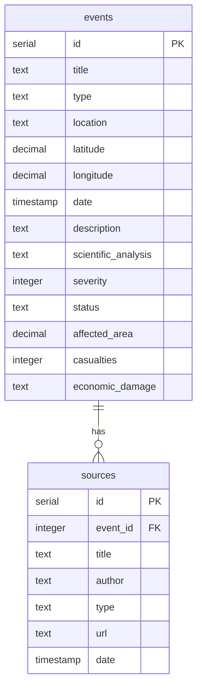

# PlanetAlert 🌍

Piattaforma di monitoraggio e documentazione degli eventi naturali in Italia.

## 🚀 Caratteristiche

- 🗺️ Mappa interattiva degli eventi naturali
- 📊 Dashboard con statistiche e analisi
- 📱 Interfaccia responsive e moderna
- 🌓 Supporto tema chiaro/scuro
- 🔍 Ricerca e filtri avanzati
- 📄 Documentazione scientifica dettagliata

## 🛠️ Tecnologie

- [Next.js 15](https://nextjs.org/)
- [TypeScript](https://www.typescriptlang.org/)
- [Tailwind CSS](https://tailwindcss.com/)
- [Radix UI](https://www.radix-ui.com/)
- [PostgreSQL](https://www.postgresql.org/)
- [Drizzle ORM](https://orm.drizzle.team/)
- [Leaflet](https://leafletjs.com/)

## 🏗️ Sviluppo

1. **Clona il repository in Codespaces**:
   - Clicca sul pulsante verde "Code"
   - Seleziona la tab "Codespaces"
   - Clicca "Create codespace on main"

2. **Setup dell'ambiente**:
   ```bash
   # Rendi eseguibile lo script di setup
   chmod +x .devcontainer/setup.sh
   
   # Esegui lo script di setup
   .devcontainer/setup.sh
   ```

3. **Avvia l'applicazione**:
   ```bash
   pnpm dev
   ```

4. **Gestione del database**:
   ```bash
   # Genera le migrazioni
   pnpm db:generate
   
   # Applica le migrazioni
   pnpm db:push
   
   # Apri Drizzle Studio
   pnpm db:studio
   ```

## 📝 Struttura del Database



## 🤝 Contribuire

Le contribuzioni sono benvenute! Per favore:

1. 🍴 Fai un fork del repository
2. 🌿 Crea un branch per le tue modifiche (`git checkout -b feature/AmazingFeature`)
3. 💾 Committa le modifiche (`git commit -m 'Add some AmazingFeature'`)
4. 📤 Pusha sul branch (`git push origin feature/AmazingFeature`)
5. 🔄 Apri una Pull Request

## 📄 Licenza

Distribuito sotto licenza MIT. Vedi `LICENSE` per maggiori informazioni.

## 📧 Contatti

Sergio Cima - [@tuotwitter](https://twitter.com/tuotwitter)

Link Progetto: [https://github.com/tuousername/planetalert](https://github.com/tuousername/planetalert)